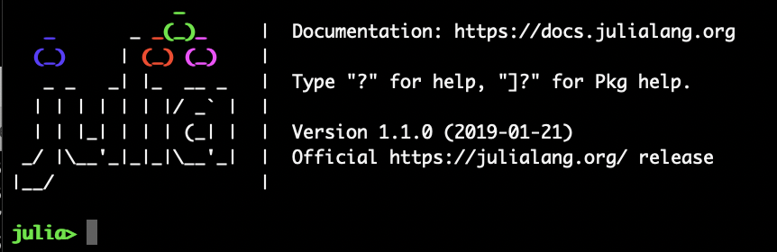
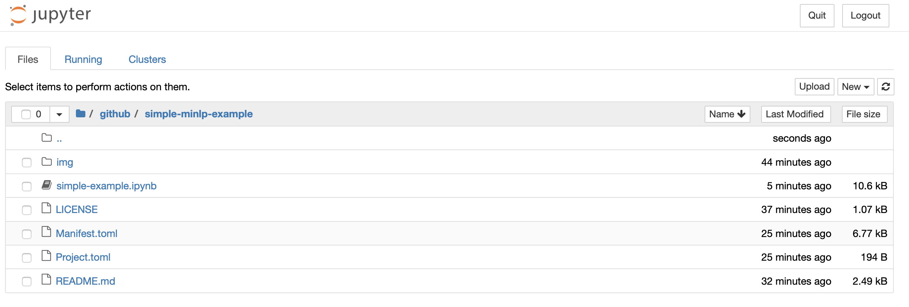

# Simple MINLP Examples

This page includes some very simple convex quadratic NLP and convex quadratic MINLP examples.

### Install Julia

To get started, you first need to install Julia.

 - Download and install Julia v1.2 from [https://julialang.org/downloads/](https://julialang.org/downloads/).

**Windows 7 Users**: as instructed on the downloads page, you will need to
install at least version 3.0 of the [Windows Management Framework](https://docs.microsoft.com/en-us/powershell/wmf/overview).

### Download the materials

To get all files  [download this zip file](https://github.com/juan-pablo-vielma/simple-minlp-example/archive/master.zip) and uncompress it to a folder of your choice. This will create a sub-folder `simple-minlp-example` with all the materials.

### Open Julia

Now open Julia by clicking on the Julia icon you installed. Once open, you should be faced with the Julia *REPL* (Julia's interactive command prompt) that looks like this:



### Install Jupyter

Now we need to install [Jupyter](http://jupyter.org/).
In the Julia REPL, run the following commands (this may take a little bit of time):
```julia
import Pkg
ENV["JUPYTER"]=""
Pkg.add("Conda")
Pkg.add("IJulia")
import Conda
Conda.add("jupyter")
```

### Open a Jupyter notebook

Okay, last step, let's launch a Jupyter notebook! Open a Julia REPL and then run:
```julia
using IJulia
IJulia.notebook()
```

If all goes well, a browser window will open that looks like this:


You can then navigate to the location of where you uncompressed the `simple-minlp-example` folder and you should see something like this:


To get started on the tutorials, click on the first notebook entitled `simple-example.ipynb`.

### Using the Default Tutorial Packages

The files `Project.toml` and `Manifest.toml` contain versions of all packages needed for the example. These packages can be _activated_ by running the following code in any Jupyter notebook in the `simple-minlp-example` folder:
```julia
import Pkg
Pkg.activate(@__DIR__)
Pkg.instantiate()
```
You will see this as the first code cell of `simple-example.ipynb`.


### Updating Tutorial Files and Packages
To get the latest version of this repository (files and safe versions of packages) simply [re-download this zip file](https://github.com/juan-pablo-vielma/simple-minlp-example/archive/master.zip), which always contains the latest versions.
